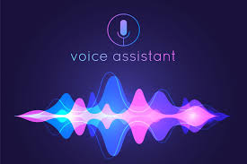

# Personal Voice Assistant



A simple **personal voice assistant** for **Windows**, written in Python. This assistant listens for a wake word ("assistant" by default) and performs basic tasks such as telling the time/date, opening websites and applications, playing local music, performing web searches, and telling jokes.

## Features (v1)
- Wake-word detection ("assistant").
- Voice input (SpeechRecognition using Google's recognizer).
- Text-to-speech (pyttsx3).
- Open websites and applications.
- Tell current time and date.
- Play local music from `assets/music/` (requires `pygame`).
- Tell jokes using `pyjokes`.
- Simple fallback: search the web for unknown commands.

## Requirements & Notes (Windows)
- Python 3.8+ recommended.
- Important: `PyAudio` is required by `SpeechRecognition` for microphone input on Windows. Installing PyAudio on Windows is easiest using `pipwin`:
```bash
pip install pipwin
pipwin install pyaudio
```
- Alternatively, install the correct `whl` from unofficial binaries or use Conda.
- Install other Python packages:
```bash
pip install -r requirements.txt
```

## Project Structure
```
windows_personal_voice_assistant/
├── src/
│   ├── main.py
│   └── assistant.py
├── assets/
│   └── music/           # put some .mp3 or .wav files here to enable "play music"
├── requirements.txt
└── README.md
```

## Running
1. Install PyAudio (via pipwin) and other requirements (see above).
2. Add at least one music file to `assets/music/` if you want music playback.
3. Run the assistant:
```bash
python src/main.py
```
4. Say the wake word (default: "assistant"), then speak a command such as:
- "What time is it?"
- "Open YouTube"
- "Search for python tutorials"
- "Play music"
- "Tell me a joke"

## Customization
- Change the `user_name` or `wake_word` in `src/main.py` when constructing `VoiceAssistant`.
- Edit `assistant.open_application_by_name` mapping to include paths to your local applications.

## Security & Privacy
- This example uses Google's speech recognition API (online) by default via the `speech_recognition` library. For an entirely offline solution, consider using an offline speech-to-text model or service.
- No data is stored by the assistant in this sample implementation.

